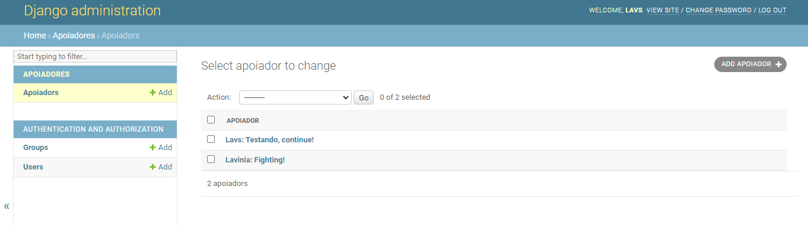
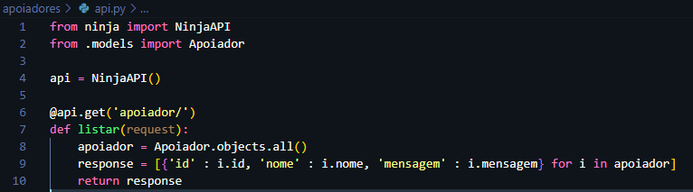
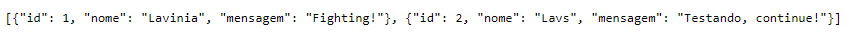

<h1 align="center"> Apoie Fábulas </h1>

</img>

  

 Projeto desenvolvido com Django e Pyhton. 
 

  <a href="Sobre o projeto">Sobre o projeto</a>&nbsp;&nbsp;&nbsp;|&nbsp;&nbsp;&nbsp; 
  <a href="#-tecnologias">Tecnologias</a>&nbsp;&nbsp;&nbsp;|&nbsp;&nbsp;&nbsp;
  <a href="Autor">Autor</a>&nbsp;&nbsp;&nbsp;&nbsp;&nbsp;&nbsp; 

 

# Sobre o projeto

Apoie Fábulas é um projeto back-end focado para aprendizado introdutório do web framework Django Ninja.
A aplicação consiste em uma página web que deve exibir o nome e a mensagem do apoiador do projeto [Fábulas Lunares](https://www.instagram.com/fabulaslunares/ "Instagram do Fábulas").

Para o projeto foi utilizado o ambiente virtual. É realizada a conexão com o banco de dados e através do painel de administrador é possível adicionar o nome do apoiador e a mensagem. 

</img>

O Django Ninja faz a serialização dos dados... 

</img>
 

...devolvendo um arquivo JSON.

</img>
 

  

## 🚀 Tecnologias

Esse projeto foi desenvolvido com as seguintes tecnologias:
- Django
- Python
- Git e Github

# Autor

Lavínia Souza Silveira

https://www.linkedin.com/in/lav%C3%ADnia-silveira-896b2624a/
